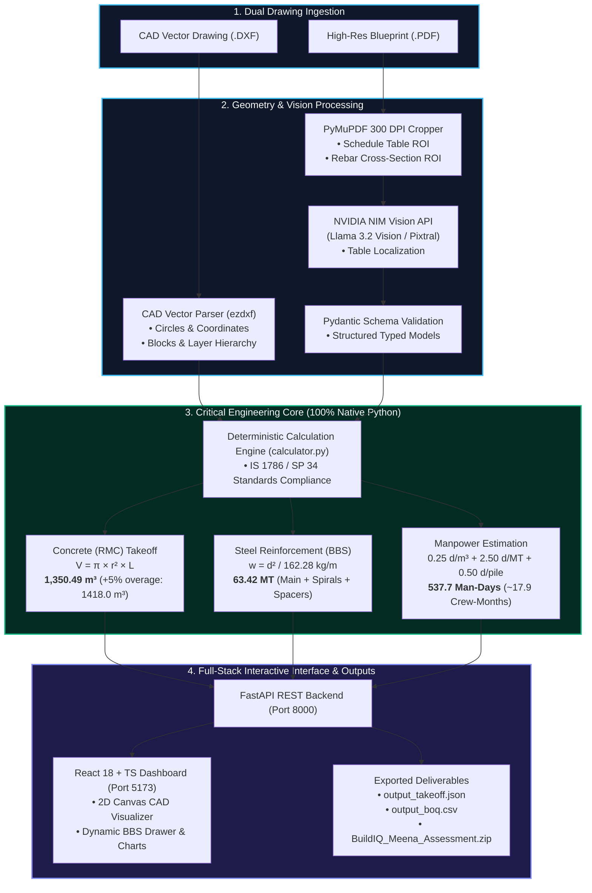

# material calculation platform for dxf files — Automated Pile Foundation Takeoff Engine

[](https://www.python.org/)
[](https://fastapi.tiangolo.com/)
[](https://reactjs.org/)
[](https://build.nvidia.com/)
[]()

> **Full-Stack AI Application**: Automated structural foundation quantity takeoff, volumetric extrusions, Bar Bending Schedule (BBS) steel calculations, and manpower estimation from CAD (`.DXF`) and Blueprint (`.PDF`) drawings.

---

## 1. Project Overview

The **BuildIQ AI Takeoff Engine** bridges the gap between unstructured civil blueprints, vector CAD geometries, and precision cost estimating. It delivers an end-to-end full-stack platform that:
- Ingests high-resolution blueprint PDFs and AutoCAD DXF drawings.
- Leverages **NVIDIA NIM Multimodal Vision models** for high-accuracy tabular schedule extraction and cross-section parsing.
- Executes **100% deterministic, zero-drift civil calculations in native Python** (IS 1786 / SP 34 standards).
- Visualizes foundation layouts on an interactive **2D Canvas CAD viewer** with diameter filtering, coordinate tooltips, and real-time Bar Bending Schedule (BBS) inspection.
- Generates commercial Bill of Quantities (`output_boq.csv`) and machine-readable takeoff artifacts (`output_takeoff.json`).

---

## 2. System Architecture & Technology Stack



### Technology Stack:
| Layer | Technologies & Tools | Purpose |
| :--- | :--- | :--- |
| **Core Language** | **Python (v3.10 - v3.14)** | Primary backend runtime, deterministic mathematics, and pipeline orchestration |
| **Backend Framework** | **FastAPI**, Uvicorn, Pydantic v2, pydantic-settings | High-performance asynchronous REST API and strict schema validation |
| **Frontend UI** | **React 18**, **TypeScript**, Vite, Tailwind CSS, Recharts | Interactive dashboard, 2D Canvas CAD rendering, live BBS drawer, visual analytics |
| **CAD Processing** | **`ezdxf`** (Python CAD Library) | CAD modelspace entity parsing, circle coordinates, anonymous block traversal |
| **Vision & PDF Engine** | **`PyMuPDF`** (Fitz), OpenCV | 300 DPI high-resolution sheet rasterization and Region of Interest (ROI) slicing |
| **AI / Multimodal** | **NVIDIA NIM API** (`meta/llama-3.2-90b-vision-instruct`) | Visual table localization and zero-shot schema extraction |
| **Calculation Engine** | **Native Python Math Engine** (IS 1786 / SP 34) | 100% deterministic volumetric and steel weight mathematical execution |
| **Storage & Deliverables** | JSON, CSV, ZIP | Standard estimating deliverables (`output_takeoff.json`, `output_boq.csv`) |

---

## 3. Key Full-Stack Features

1. **Executive KPI Cards**: Instant summary of Total Piles (**83 Nos**), RMC Concrete Volume (**1,350.49 m³**), Steel BBS Tonnage (**63.42 MT**), and Manpower (**537.7 Man-Days**).
2. **2D Canvas CAD Geometry Visualizer**:
   - Interactive zoom, pan, and hover tooltips displaying exact spatial CAD coordinates $(x, y)$.
   - Real-time diameter filters (All, Ø500mm, Ø700mm, Ø800mm, Ø900mm).
3. **Structured Pile Inventory Table**: Searchable and sortable breakdown of pile tags, depths, capacities, and group multipliers.
4. **Interactive Bar Bending Schedule (BBS) Drawer**:
   - Detailed component breakdown (Main Longitudinal bars, Helical Spiral Ties, Stiffener Spacers).
   - Real-time computation of cut lengths and unit weights ($d^2/162.28$).
5. **Analytics & Productivity Charts**: Visual distribution of concrete by pile tag, steel by component type, and labor allocation by activity.
6. **NVIDIA NIM Multimodal Studio**: Real-time schema validation visualizer with Pydantic JSON drawer.
7. **Deliverables Export Center**: Live preview and one-click download for `output_takeoff.json`, `output_boq.csv`, and submission ZIP.

---

## 4. Project Directory Structure

```
.
├── backend/
│   ├── app/
│   │   ├── api/endpoints.py           # FastAPI REST endpoints
│   │   ├── core/config.py             # Settings, pydantic-settings, environment config
│   │   ├── models/schemas.py          # Pydantic schemas (Pile, RebarDetail, Takeoff, BOQ)
│   │   ├── services/
│   │   │   ├── calculator.py          # 100% Native Python civil math & BBS engine
│   │   │   ├── dxf_parser.py          # ezdxf CAD geometry & schedule table extractor
│   │   │   ├── pdf_vision_parser.py   # PyMuPDF 300-DPI HD ROI cropper
│   │   │   ├── nvidia_nim_extractor.py# NVIDIA NIM Multimodal Vision client
│   │   │   ├── extractor.py           # Unified pipeline orchestrator
│   │   │   └── exporter.py            # Generates output JSON, CSV, and ZIP
│   │   └── main.py                    # FastAPI application entrypoint
│   ├── tests/                         # Unit test suite (7 passing tests)
│   ├── generate_artifacts.py          # Script to generate standard takeoff outputs
│   ├── requirements.txt               # Backend dependencies
│   ├── README.md                      # Detailed civil engineering formulas & math
│   └── .env / .env.example
├── frontend/
│   ├── src/
│   │   ├── components/                # Navbar, KPICards, CADViewer, BBSViewer, Charts, etc.
│   │   ├── types/takeoff.ts           # TypeScript interfaces
│   │   └── services/api.ts            # Axios API service
│   ├── package.json, vite.config.ts, tailwind.config.js
├── scripts/
│   ├── setup_windows.ps1 & .bat       # One-click Windows setup scripts
│   ├── setup_ubuntu.sh                # Ubuntu / Debian Linux setup script
│   └── setup_mac.sh                   # macOS setup script
├── output_takeoff.json                # Generated JSON takeoff artifact
├── output_boq.csv                     # Generated CSV Bill of Quantities artifact
├── .env / .env.example                # Unified root environment configuration
└── README.md                          # Project overview (this document)
```

---

## 5. Quick Start & Multi-OS Setup

### Option A: One-Click Automated Setup

#### Windows (PowerShell / Command Prompt):
```powershell
.\scripts\setup_windows.ps1
# or
.\scripts\setup_windows.bat
```

#### Ubuntu / Debian Linux:
```bash
chmod +x scripts/setup_ubuntu.sh
./scripts/setup_ubuntu.sh
```

#### macOS:
```bash
chmod +x scripts/setup_mac.sh
./scripts/setup_mac.sh
```

---

### Option B: Manual Execution

#### 1. Backend (FastAPI - Port 8000):
```bash
cd backend
python -m venv .venv

# Activate virtual environment:
# Windows: .venv\Scripts\activate
# Linux/Mac: source .venv/bin/activate

pip install -r requirements.txt
cp .env.example .env

# Run Tests & Pre-generate Artifacts
pytest tests
python generate_artifacts.py

# Start Server
python app/main.py
```
> Backend runs at: **http://127.0.0.1:8000** (Swagger API docs at `/docs`)

#### 2. Frontend (React 18 + Vite - Port 5173):
```bash
cd frontend
npm install
npm run dev
```
> Open **http://localhost:5173** in your browser.

---
