# BuildIQ AI — Backend Flow Chart (Developer View)

> **Scope**: `backend/` of the **Automated Pile Foundation Takeoff Engine**.
> This document traces the backend from **import/startup** → **API routing** → **pipeline orchestration** → **service internals** → **native engineering math** → **export artifacts**, including every fallback / fault-isolation path.
> All diagrams are **Mermaid** and render natively on GitHub.

---

## Contents

- [1. Module Dependency Graph](#1-module-dependency-graph)
- [2. Application Startup Flow](#2-application-startup-flow)
- [3. API Endpoints](#3-api-endpoints)
- [4. Core Pipeline (TakeoffExtractorPipeline)](#4-core-pipeline-takeoffextractorpipeline)
- [5. Service Sub-Flows](#5-service-sub-flows)
- [6. Fault-Tolerance and Fallback Matrix](#6-fault-tolerance-and-fallback-matrix)
- [7. Data-Flow Threading](#7-data-flow-threading)
- [8. End-to-End Happy Path](#8-end-to-end-happy-path)
- [9. Developer Onboarding Notes](#9-developer-onboarding-notes)

---

## 1. Module Dependency Graph

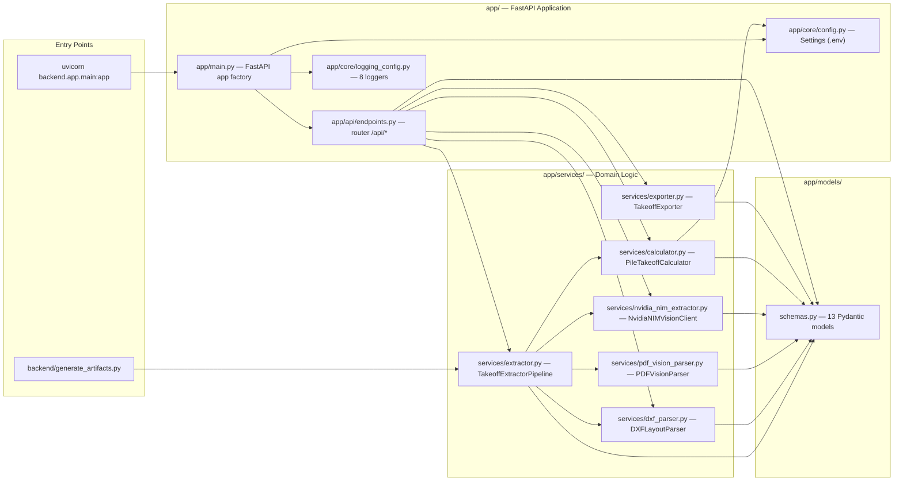

**Global singletons** created at import time: `takeoff_pipeline`, `calculator`, `exporter`, `nim_vision_client`, `pdf_vision_parser`, `dxf_parser`.

**Async boundary** (network I/O): `process_drawings`, `check_health`, `extract_schedule_from_crop`. Everything else is synchronous deterministic Python.

## 2. Application Startup Flow

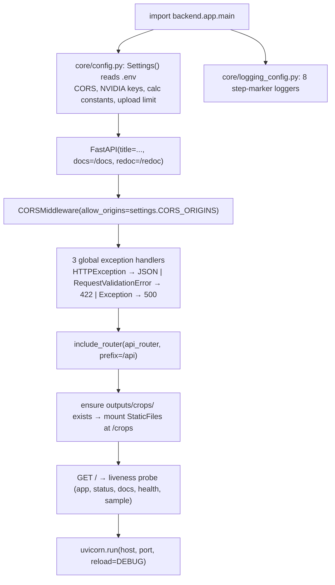

---

## 3. API Endpoints

> Prefix `/api`, all endpoints under `backend/app/api/endpoints.py`. Response model for takeoff endpoints: `TakeoffResult` (Pydantic-validated).

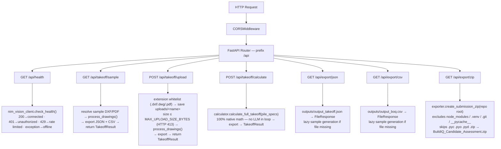

**`POST /api/takeoff/calculate` request body** — `RecalculateRequest { pile_specs: dict[], project_title?: str }`. Used by the dashboard for custom pile overrides without re-ingesting drawings.

## 4. Core Pipeline (TakeoffExtractorPipeline)

`process_drawings(dxf_path?, pdf_path?, project_title?) → TakeoffResult` — orchestrates DXF parsing, PDF vision analysis, and native calculation with complete fault isolation (each stage has its own `try/except`).

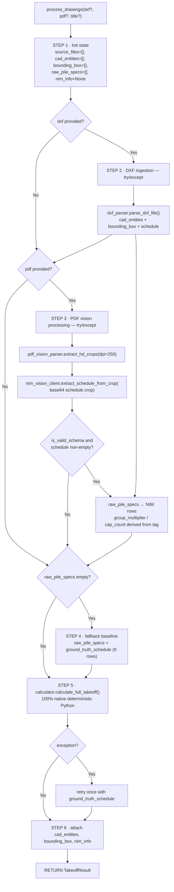

**Schedule source priority**: ① DXF spatial parse → ② NIM vision extraction → ③ hardcoded `ground_truth_schedule`.

Pipeline tag helpers:

| Helper | Behavior |
|---|---|
| `_parse_group_multiplier(tag)` | `10P…` → 10, `4P…` → 4, `3P…` → 3, `2P…` → 2, else 1 |
| `_calculate_cap_count(tag, total_piles)` | `max(1, total_piles // multiplier)` |

## 5. Service Sub-Flows

### 5a. DXF Parser — `DXFLayoutParser.parse_dxf_file(path)`

Parses CAD vectors with `ezdxf`, extracts visual entities + bounding box + schedule table (never raises — always returns a fallback dict).

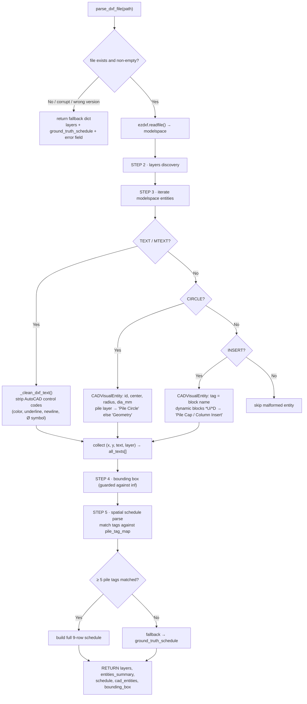

The hardcoded `ground_truth_schedule` lives here (9 verified pile types: `P50, P70A, P90, 2P70, 2P80, 2P90, 3P80, 4P80, 10P70`).

### 5b. PDF Vision Parser — `PDFVisionParser.extract_hd_crops(pdf_path, dpi=300)`

Renders HD **Region-of-Interest (ROI) crops** so the vision model never sees a downsampled full sheet.

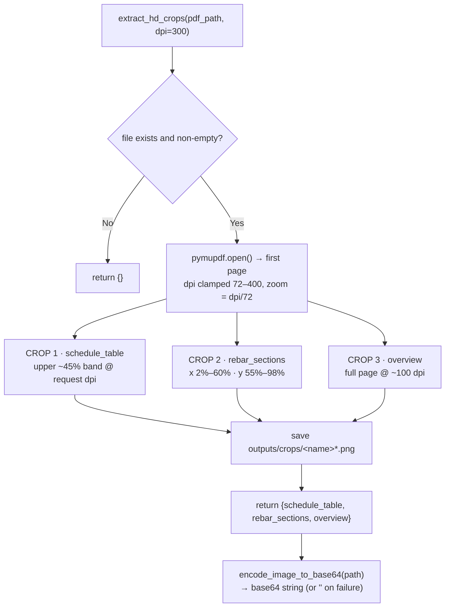

### 5c. NVIDIA NIM Vision Client — `NvidiaNIMVisionClient.extract_schedule_from_crop(b64, crop)`

Multimodal client (`meta/llama-3.2-90b-vision-instruct`) used **only** for visual parsing → strictly Pydantic-validated schema strings.

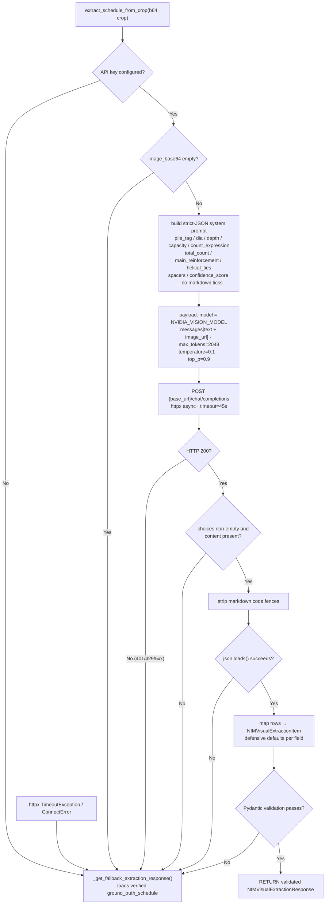

**Constraint enforcement**: the model emits schema strings only — numbers are coerced through Pydantic, and **no arithmetic ever happens inside the LLM call**.

### 5d. Native Python Calculator — `PileTakeoffCalculator.calculate_full_takeoff()`

The **100% deterministic engineering core** — all volumetric, BBS (`d²/162.28` per IS 1786), and manpower math in plain Python. No LLM in the numerical loop.

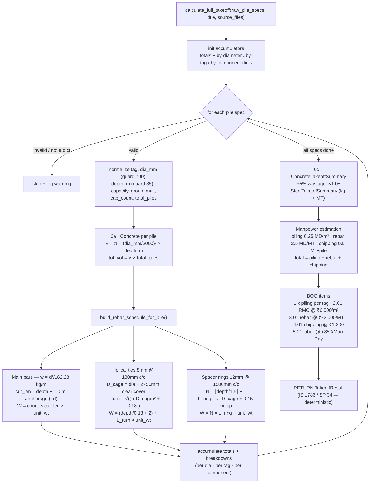

Mixed-diameter cages (e.g. `P90` = 5×Ø20mm + 5×Ø16mm) are supported: the exact `d²/162.28` unit weight is applied per bar subset before summation.

### 5e. Exporter — `TakeoffExporter`

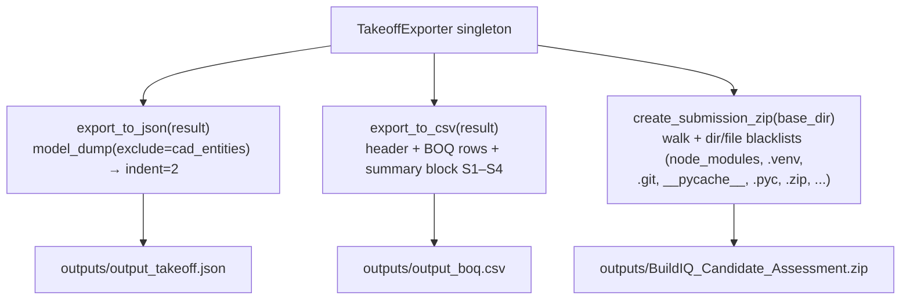

### 5f. Standalone entrypoint — `backend/generate_artifacts.py`

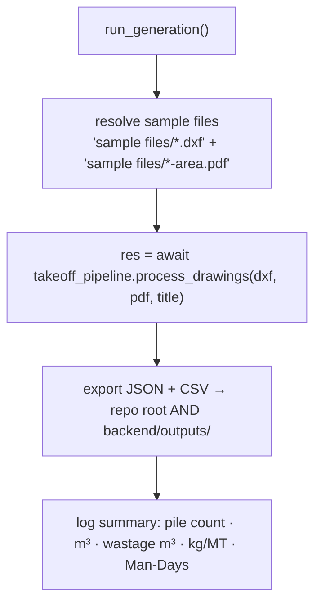

## 6. Fault-Tolerance and Fallback Matrix

| Failure Point | Trigger | Behavior |
|---|---|---|
| DXF missing / corrupt / wrong version | `parse_dxf_file` exceptions | returns fallback dict incl. `ground_truth_schedule`; pipeline continues |
| PDF missing / empty / 0 pages | `extract_hd_crops` | returns `{}`; pipeline continues on DXF schedule |
| NIM API key not configured | `is_configured()` false | `_get_fallback_extraction_response()` = ground-truth rows |
| NIM HTTP error / timeout / empty choices / bad JSON / ValidationError | `extract_schedule_from_crop` | structured fallback response; pipeline continues |
| All extractions fail | `raw_pile_specs` empty | pipeline uses `dxf_parser.ground_truth_schedule` |
| Calculator exception mid-run | `calculate_full_takeoff` | retried once with ground-truth specs |
| Calculator keeps failing | second exception | bubbles to API handler → HTTP 500 structured JSON |
| Upload bad extension | endpoints | HTTP 400 `Unsupported file format` |
| Upload too large | size > `MAX_UPLOAD_SIZE_BYTES` | temp file deleted → HTTP 413 |
| Export file missing (json/csv) | export endpoints | lazily generates sample takeoff, then serves file |
| Exporter permission error (locked file) | `open()` fails | logs error, returns path (API guards existence) |

---

## 7. Data-Flow Threading

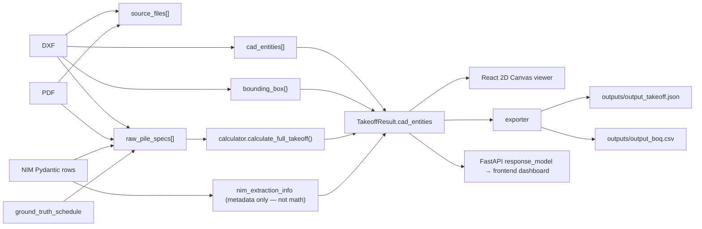

---

## 8. End-to-End Happy Path

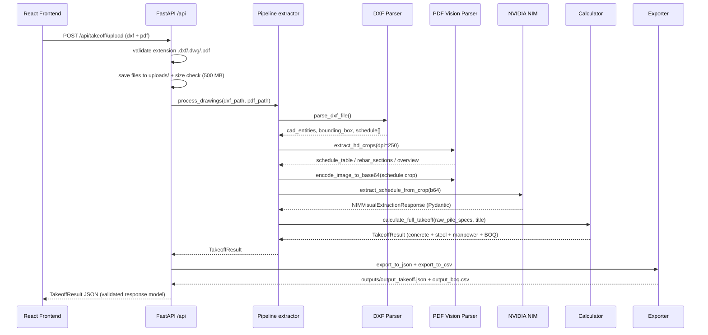

Note: `POST /api/takeoff/calculate` short-circuits this flow — it takes user-supplied `pile_specs` straight to the Calculator (no drawing ingestion).

---

## 9. Developer Onboarding Notes

1. **Run from the repo root** — all imports use `backend.app.*`; cwd must be the project root, not `backend/`.
2. **Stateless singletons** — services are import-time instances; no DB; persistence is files in `uploads/` and `outputs/`.
3. **LLM does no math** — NVIDIA NIM returns schema strings; Pydantic coerces them; only `calculator.py` performs arithmetic (IS 1786 `d²/162.28`, SP 34).
4. **Ground truth is the safety net** — `dxf_parser.ground_truth_schedule` and the NIM fallback both carry the same 9 verified pile rows (`P50 … 10P70`).
5. **Step-marker logging** — every module logs `[STEP n]`, so a full pipeline run is traceable end-to-end via the `buildiq.*` loggers.
6. **Frontend binary assets** — the 2D CAD viewer consumes `cad_entities`; PDF crops are served through the static `/crops` mount.
7. **Custom recalc** — `POST /api/takeoff/calculate` recomputes quantities from user `pile_specs` without re-ingesting drawings — pure native math path.

---

*Generated from the actual `backend/` source (FastAPI, Pydantic, ezdxf, PyMuPDF, NVIDIA NIM client). All diagrams verified against module behavior.*