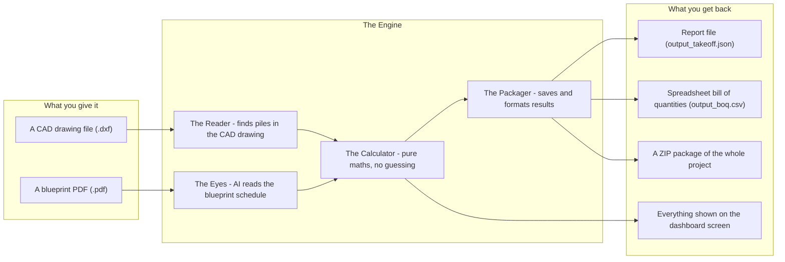
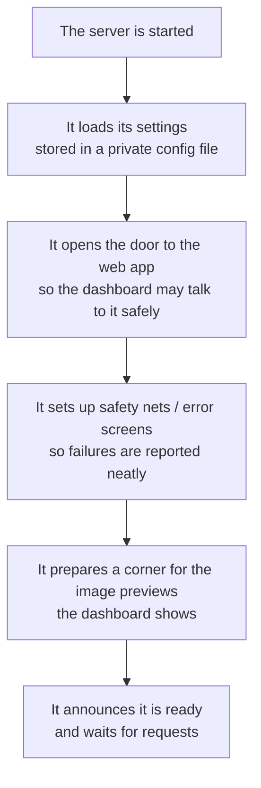
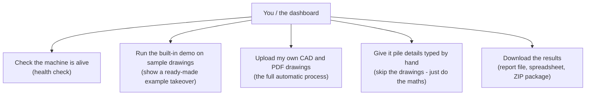
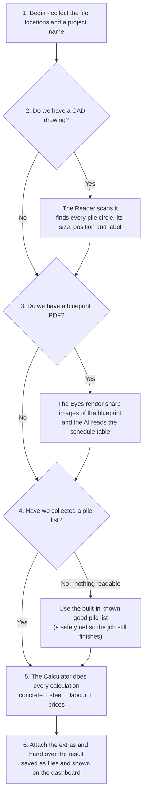
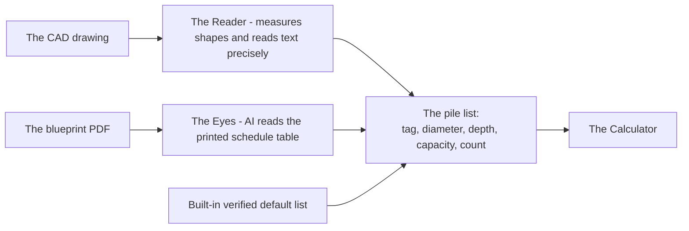
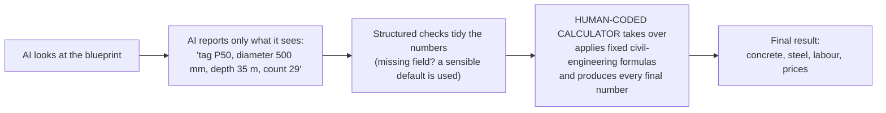
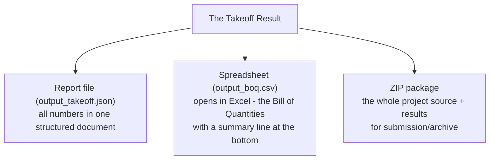
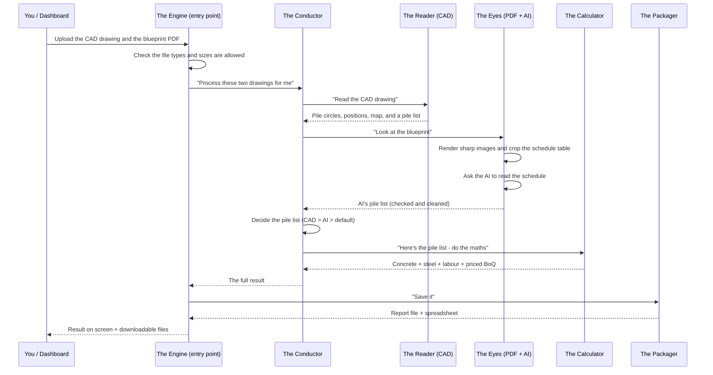

# BuildIQ AI — How the Engine Works (Plain-English Guide)

> **What this is**: a simple explanation of how the pile-foundation takeoff engine reads your drawings, works out the numbers, and hands you the results.
> No code knowledge needed — this is the same system described in `docs/BACKEND_FLOWCHART.md`, but in everyday language.
> The diagrams are **Mermaid** and render automatically on GitHub.

---

## Contents

- [1. What This System Does](#1-what-this-system-does)
- [2. The Big Picture](#2-the-big-picture)
- [3. Starting the Machine](#3-starting-the-machine)
- [4. The Things You Can Ask It To Do](#4-the-things-you-can-ask-it-to-do)
- [5. The Main Journey — Uploading Drawings](#5-the-main-journey-uploading-drawings)
- [6. Where the Pile Information Comes From](#6-where-the-pile-information-comes-from)
- [7. The Golden Rule — "The AI Reads, the Calculator Decides"](#7-the-golden-rule-the-ai-reads-the-calculator-decides)
- [8. What Comes Out the Other End](#8-what-comes-out-the-other-end)
- [9. If Something Goes Wrong](#9-if-something-goes-wrong)
- [10. The Whole Story in One Picture](#10-the-whole-story-in-one-picture)
- [11. A Quick Glossary](#11-a-quick-glossary)

---

## 1. What This System Does

In construction, a **pile foundation** is made of long concrete columns ("piles") driven into the ground to hold up a building. Before ordering materials or labour, an engineer must measure everything from the drawings — a task called a **takeoff**.

This engine does that measurement automatically. You feed it two kinds of drawing files:

- **A CAD drawing (`.dxf`)** — a vector file where every circle and label is stored as exact math, so the computer can measure positions and diameters precisely.
- **A blueprint PDF (`.pdf`)** — a picture of the same drawing, useful because it contains the "schedule table" (the list of pile types and sizes).

The engine reads both, works out **exactly how much concrete, steel, and labour** the project needs, checks them against standard civil-engineering formulas, and hands you:

- a readable **report file** (JSON),
- a **bill of quantities spreadsheet** (CSV, opens in Excel), and
- a **downloadable ZIP** of everything.

## 2. The Big Picture

Think of the engine as a small team of workers:

| Team member | What it does | Plain-English name |
|---|---|---|
| **The Reader** | Opens the CAD drawing and finds every pile circle, its size and position | Reads the drawing like a ruler |
| **The Eyes** | Turns the blueprint into sharp images and reads the schedule table with AI | Looks at the drawing like a human would |
| **The Calculator** | Does all the maths using standard civil-engineering formulas | Never guesses — always computes |
| **The Packager** | Saves the results as files and sends them back to the screen | Files the paperwork |

**Two important ground rules:**

1. **The AI only reads — it never calculates.** The AI looks at the blueprint and reports back what it sees (like a site supervisor reading numbers aloud). Every actual calculation is done by the Calculator using trusted formulas.
2. **If anything misbehaves, the engine keeps going.** The system is built to survive a missing file, an offline AI service, or a strange drawing — it falls back to known-good values instead of crashing.

---

## 3. Starting the Machine

When the backend server is switched on, it does a few routine things before it can help anyone:

That's it. From then on, it just waits for someone to ask it to do a job.

## 4. The Things You Can Ask It To Do

The engine exposes a handful of simple "buttons". These are the actions the dashboard (or any computer program) can call:

| Action | In plain words |
|---|---|
| **Health check** | "Are you awake, and is your AI helper reachable?" — returns a simple status. |
| **Sample takeoff** | Runs everything on the included sample drawings so you can see the output without uploading anything. |
| **Upload drawings** | The main event: you send a CAD drawing and/or a blueprint PDF, and the engine runs the full process described below. |
| **Recalculate by hand** | You already know the pile list (diameters, depths, counts) and you just want the quantities. The engine skips reading files and goes straight to the maths. |
| **Download results** | Gets the finished report (`output_takeoff.json`) or spreadsheet (`output_boq.csv`) as files, or the complete submission ZIP. |

> **Upload rules**: files must be `.dxf`, `.dwg`, or `.pdf`, and each file may be up to 500 MB. Anything else is politely refused before any work begins.

---

## 5. The Main Journey — Uploading Drawings

This is the heart of the system. When you upload drawing files, the engine follows six steps, and each step is protected — meaning if one part fails, the others still do their jobs.

Let's walk through each step.

### Step 1 · Starting
The engine takes the file locations and the project name you gave it, and prepares blank sheets for everything it's about to collect.

### Step 2 · The Reader looks at the CAD drawing
The CAD reader opens the vector drawing and finds:
- **Pile circles** — their centres, radii (and therefore diameters), and the layer they sit on;
- **Labels and text** — cleaned up (AutoCAD sometimes buries formatting codes in text, which get stripped);
- **Block inserts** — pile caps and other repeated objects;
- **A bounding box** — the overall area of the drawing.

It collects all of that into a miniature map of the drawing. It also *tries* to read the pile schedule table directly from the text positioned in the drawing. If it can clearly identify the pile tags in the table, it builds the pile list itself.

### Step 3 · The Eyes read the blueprint with AI
Blueprints are huge; sending the whole page to an AI would blur the small schedule table. So:
1. The blueprint page is turned into a **high-resolution image**;
2. The engine **crops** the important regions — the schedule table area, the rebar cross-section area, and the overall overview;
3. The schedule-table crop is sent to an **AI vision model** (hosted on NVIDIA's NIM service) with strict instructions to return only the pile list as a structured table: pile tag, diameter, depth, capacity, count, reinforcement details;
4. The AI's answer is **checked and cleaned** before it's trusted.

### Step 4 · Picking the pile list (the safety net)
The engine now has zero, one, or two versions of the pile list. It trusts them in this order:
1. **The CAD reader's** reading of the schedule (most precise — real coordinates);
2. **The AI's** reading of the blueprint (great when the PDF has the schedule);
3. **The built-in known-good list** (used only if both of the above come back empty).

> In other words: two readers don't argue — if the CAD says one thing and the AI agrees, great; if only one works, that one is used; if neither works, a verified default list keeps the job moving.

### Step 5 · The Calculator does the real work
For every pile type it computes — with plain, audited mathematics:

- **Concrete**: the volume of a cylinder, `volume of one pile = base area × length`, then totalled across all piles, plus a 5% wastage allowance for site losses.
- **Steel**: a full bar-bending schedule — main bars, spiral ties, and spacer rings — using the standard IS 1786 unit-weight formula (weight of a bar = diameter² ÷ 162.28 kg per metre), with anchorage allowances and clear-cover subtractions.
- **Labour**: man-days for piling and concreting, rebar fabrication, and pile-head chipping, using standard productivity rates.
- **Prices**: a bill of quantities with benchmark INR rates (piling per metre, RMC concrete per m³, reinforcement per metric tonne, chipping per pile, labour per man-day).

Every figure here is produced by fixed formulas — the AI is not involved at this stage at all. That's the golden rule.

### Step 6 · Hand-over
The final result — total pile count, concrete volume, steel tonnage, man-days, and the full Bill of Quantities — is:
- written to the **report file** and **spreadsheet**;
- sent back to the dashboard so you can see it on screen, along with the CAD map for the 2-D viewer and the crop images for reference.

## 6. Where the Pile Information Comes From

- **The CAD reader** is best for *geometry*: where each pile is, how big its circle is, and any text it can find in the drawing file.
- **The AI reader** is best for *tables*: the schedule printed on the blueprint, including reinforcement details that may live only on the PDF.
- **The built-in default** is a pre-verified schedule of the sample project (pile types P50 through 10P70). It exists purely as a safety net so the engine never returns "nothing" — even when both files are unusable, you get a complete, valid takeoff.

---

## 7. The Golden Rule — "The AI Reads, the Calculator Decides"

This is the most important design principle of the whole engine.

**Why this matters:** an AI can mis-read a drawing or hallucinate a number. A formula can't. So the AI is allowed to *read* (and only read) while **every final quantity is computed by deterministic, auditable code** using standard formulas (IS 1786 for steel unit weight, basic cylinder geometry for concrete, fixed productivity ratios for labour).

If the AI service is unavailable, rate-limited, or returns garbage — the engine simply falls back to the verified default pile list, and the Calculator still produces a complete answer. The maths is never held hostage by the AI.

## 8. What Comes Out the Other End

### The takeoff result, in four blocks

| Block | What it tells you |
|---|---|
| **Pile inventory** | Every pile type (tag), diameter, depth, capacity, and how many of each. |
| **Concrete takeoff** | Total concrete volume in cubic metres, plus the volume including a 5% wastage allowance, with breakdowns by diameter and by pile type. |
| **Steel takeoff** | Total reinforcement weight in kilograms and metric tonnes, with a full bar-bending schedule breakdown (main bars, spiral ties, spacer rings) by bar diameter and by pile type. |
| **Manpower estimate** | Man-days for piling and concreting, rebar fabrication, and pile-head chipping — plus the grand total. |
| **Bill of Quantities** | Itemised, priced schedule: piling per tag, RMC concrete supply, reinforcement fabrication and placing, pile-head chipping, and total labour, each with benchmark INR rates and amounts. |

> Check the accompanying `README.md` for the verified sample numbers: **83 piles → 1,350.491 m³ concrete, 63.4164 MT steel, 537.66 man-days**.

### The files you receive

- **`output_takeoff.json`** — the complete structured report; machines and the dashboard read this.
- **`output_boq.csv`** — a classic Bill of Quantities spreadsheet: item number, description, quantity, unit, rate, amount, plus a little summary block.
- **Submission ZIP** — one package containing the source code, tests, schemas, requirements, and the output files, ready to hand over.

---

## 9. If Something Goes Wrong

The engine is designed to degrade gracefully rather than fail loudly. Here's what it does for the common mishaps:

| What happens | What the engine does |
|---|---|
| The CAD file is missing, empty, or corrupted | The Reader skips it and the job continues with whatever else it has. A fallback (safe) structure is used. |
| The PDF is missing or has no pages | The Eyes skip it; the CAD list (or the default list) is used instead. |
| The AI helper has no key / is offline / is slow / returns nonsense | The AI reading is skipped and its part is replaced by the verified default list. No crash, no stall. |
| All sources of pile information fail | The verified default pile list is used, so you still get a complete, correct takeoff. |
| The Calculator hits an error on one pile type | That pile type is skipped with a note; the rest are still computed. |
| You upload a wrong file type | The upload is politely rejected (only `.dxf`, `.dwg`, `.pdf` are accepted). |
| A file is bigger than 500 MB | The upload is cancelled and the partial file removed. |
| You ask for a result file that doesn't exist yet | The engine quietly runs the sample takeoff first and then hands you the freshly-made file. |

The idea: **the engine should always hand you a result** — asking for forgiveness of one bad input is better than stonewalling the whole task.

## 10. The Whole Story in One Picture

Here's the full journey of a happy upload, start to finish:

And that's the whole system: **read the drawings, agree on the pile list, calculate everything with trusted maths, hand over clean files.**

---

## 11. A Quick Glossary

| Term | Plain-English meaning |
|---|---|
| **Takeoff** | The act of measuring quantities (of concrete, steel, labour) from construction drawings. |
| **Pile tag** | The short code naming a pile type (e.g. `P50`, `2P80`, `10P70`). |
| **BBS / Bar-Bending Schedule** | The list of every steel bar needed in a pile cage — size, length, number, weight. |
| **RMC** | Ready-Mix Concrete. |
| **Man-days** | A unit of labour: one person working one day. |
| **BOQ / Bill of Quantities** | The itemised, priced list of all work in a tender. |
| **JSON file** | A structured text format that computers read easily. |
| **CSV file** | A spreadsheet format that Excel opens directly. |
| **CAD (DXF)** | A vector drawing file where shapes are stored as exact coordinates. |
| **PDF blueprint** | A page image of the drawing; great for a human (or AI) to look at, less precise for measuring. |
| **NIM** | NVIDIA's AI service the engine uses to read blueprints. |
| **IS 1786** | The Indian Standard covering steel reinforcement — its unit-weight formula drives the steel calculations. |
| **Fallback / safety net** | A plan-B value used automatically when a primary source fails, so the job still completes. |

---

*This document is the plain-English companion to `docs/BACKEND_FLOWCHART.md`, which contains the full technical detail for developers.*